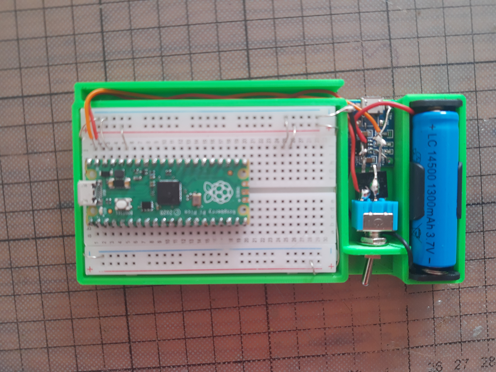
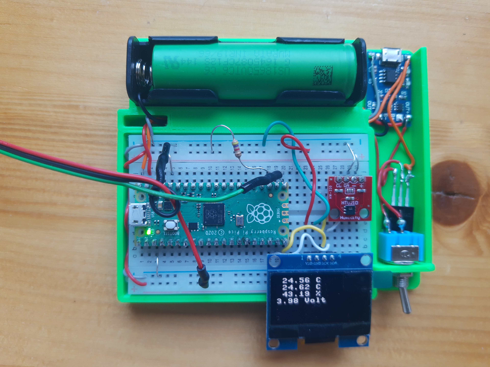

# ExperimentierBreadboard-for-Raspberry-pi-pico
The project describes how to implement the suggestion in
https://datasheets.raspberrypi.com/pico/pico-datasheet.pdf on page 22. You need a Raspberry pi pico, half a standard breadboard, a charging board for a Li-Ion battery, a switch, a battery holder and a P-channel MOS transistor (IRF9540).
The holder for the circuit was created with OpenSCAD.
The source file and STI file are part of the project.
I give no guarantee that the project will work.

I created another version for the larger 18650 cell.

The bottom line shows the charge level of the battery. It is connected to ADC(3), this AD converter is internally connected to the VSYS.
